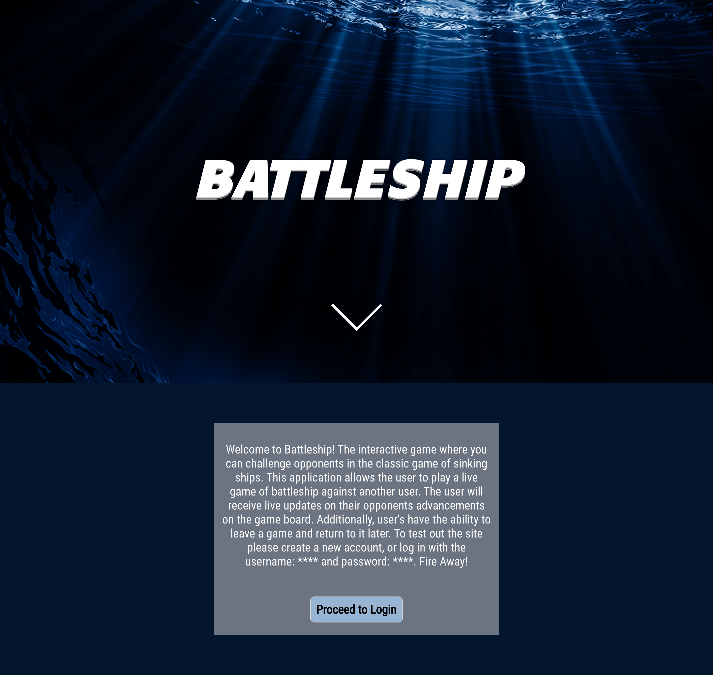
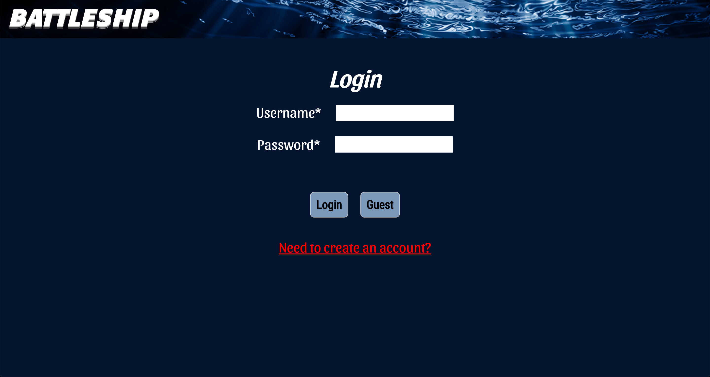
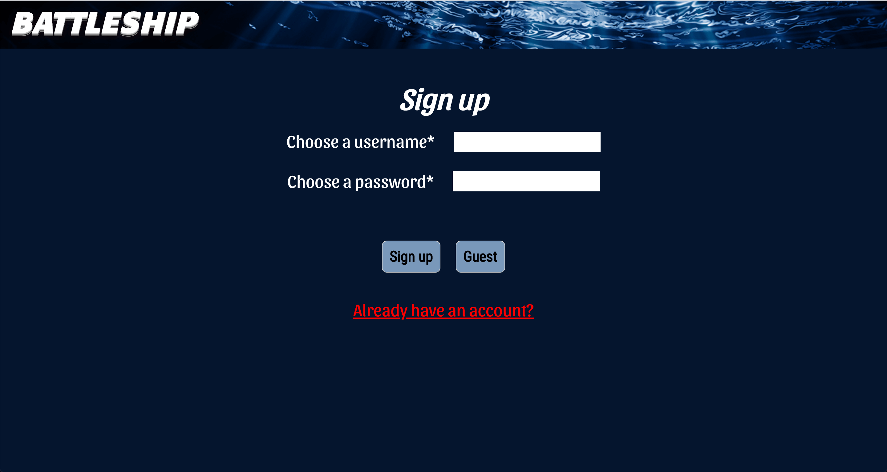
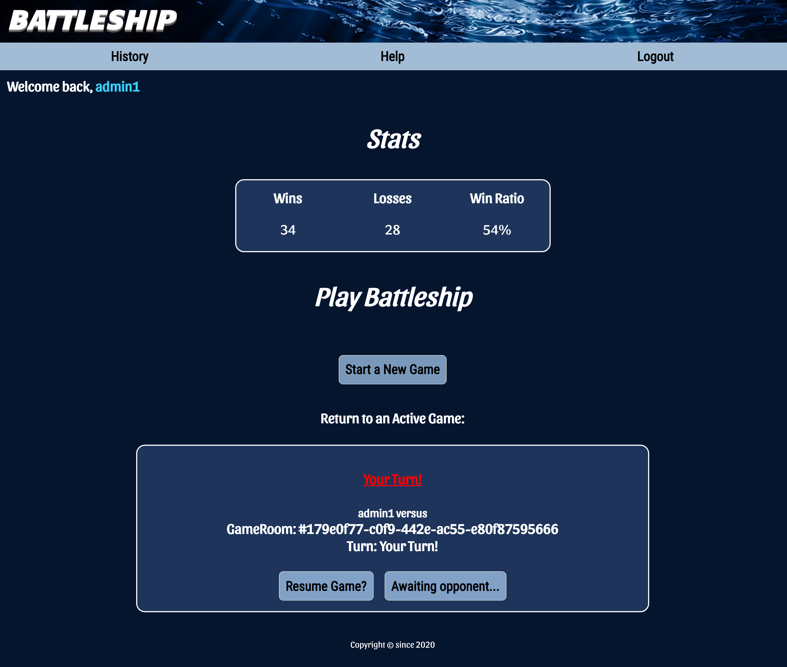
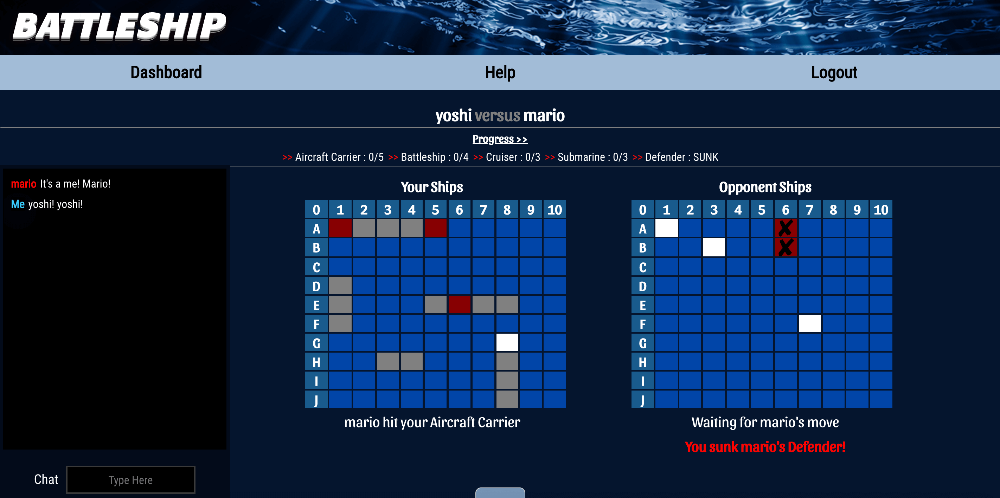
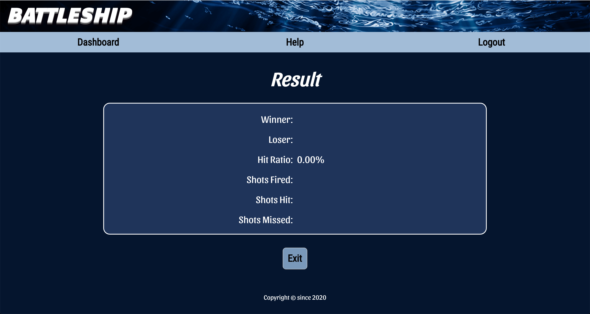
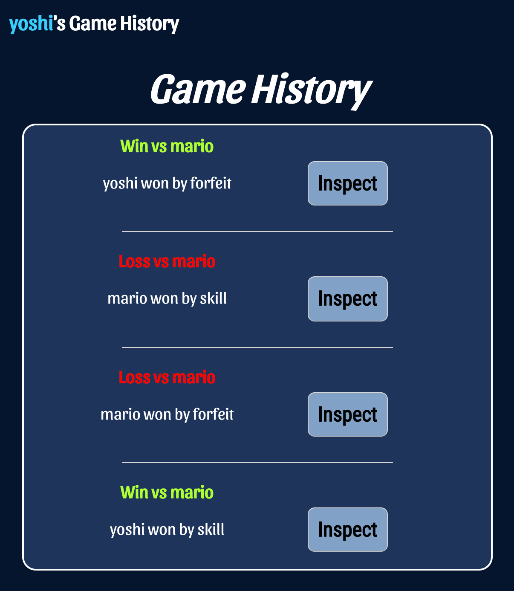
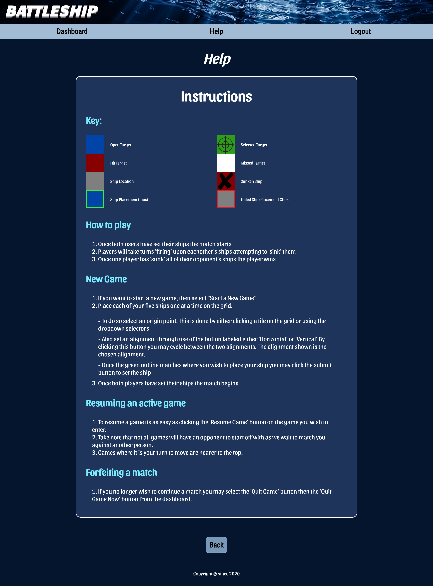

# Battleship Client

Live app: https://capstone3-battleship.now.sh/

Server GitHub: https://github.com/thinkful-ei-heron/Group1-Capstone3-Server

## Summary

Welcome to Battleship! The interactive game where you can challenge opponents in the classic game of sinking ships. 

This application allows the user to play a live game of battleship against another user. The user will receive live updates on their opponents advancements on the game board. Additionally, user's have the ability to leave a game and return to it later.

## Tutorial

### How to play
1. Once both users have set their ships the match starts
2. Players will take turns 'firing' upon eachother's ships attempting to 'sink' them
3. Once one player has 'sunk' all of their opponent's ships the player wins
### New Game
1. If you want to start a new game, then select "Start a New Game".
2. Place each of your five ships one at a time on the grid.
- To do so select an origin point. This is done by either clicking a tile on the grid or using the dropdown selectors
- Also set an alignment through use of the button labeled either 'Horizontal' or 'Vertical'. By clicking this button you may cycle between the two alignments. The alignment shown is the chosen alignment.
- Once the green outline matches where you wish to place your ship you may click the submit button to set the ship
3. Once both players have set their ships the match begins.
### Resuming an active game
1. To resume a game its as easy as clicking the 'Resume Game' button on the game you wish to enter.
2. Take note that not all games will have an opponent to start off with as we wait to match you against another person.
3. Games where it is your turn to move are nearer to the top.
### Forfeiting a match
1. If you no longer wish to continue a match you may select the 'Quit Game' button then the 'Quit Game Now' button from the dashboard.

## Technology Used

Javascript, React, CSS, HTML, Socket.io

## Screenshots

Landing Page

Login Page

Sign up Page

Dashboard Page

Gameboard Page

Result Page

Game History Page

Help Page

## Programmers

- Aedan Warfield - Project Manager - https://www.linkedin.com/in/aedanwarfield/
- Shannon Lichtenwalter - Product Owner - https://www.linkedin.com/in/shannon-lichtenwalter/
- Sean Cooper - Quality Assurance - https://www.linkedin.com/in/sean-cooper-20799a185/
- Heesu Kang - CSS Lead - https://www.linkedin.com/in/heesu-kang/
