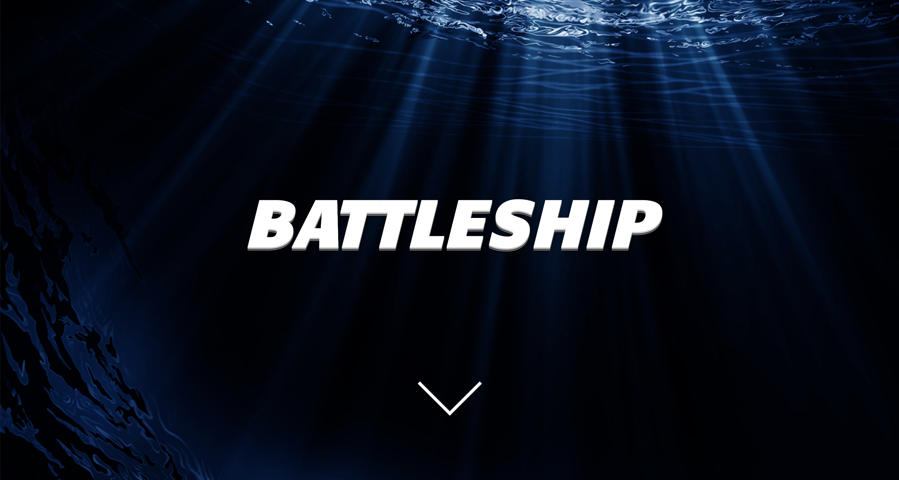
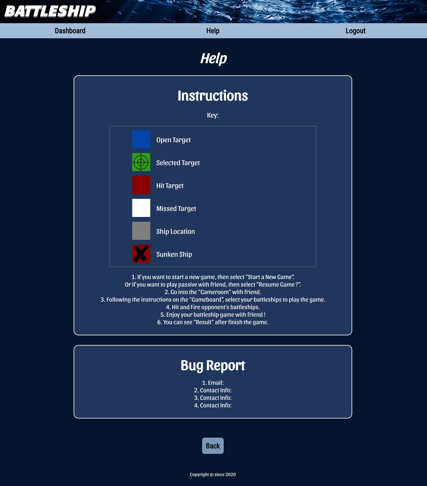

# Battleship Client

Live app: [Live](https://capstone3-battleship.now.sh/)

Server GitHub: [Github](https://github.com/thinkful-ei-heron/Group1-Capstone3-Server)

## Summary

## Tutorial

## Technology Used

Javascript, React, CSS, HTML, Socket.io

## Screenshots

Landing Page

Login Page

Sign up Page

Dashboard Page

Result Page

Help Page

## Programmers

- Aedan Warfield - Project Manager - https://www.linkedin.com/in/aedanwarfield/
- Shannon Lichtenwalter - Product Owner - https://www.linkedin.com/in/shannon-lichtenwalter/
- Sean Cooper - Quality Assurance - https://www.linkedin.com/in/sean-cooper-20799a185/
- Heesu Kang - CSS Lead - https://www.linkedin.com/in/heesu-kang/
